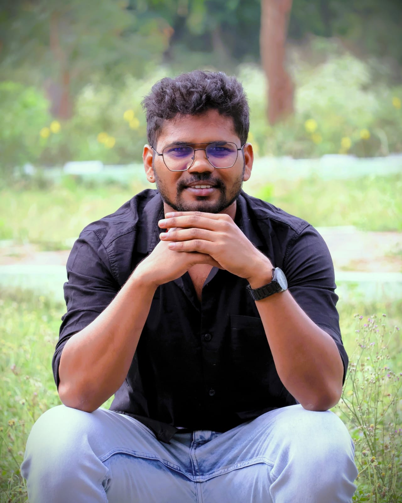

<h2 class="name">ANUGIL VELAYUDHAN</h2>

[ˈanuɡil ˈʋeːlaːjud̪ʱan]

Language Analyst | Phonetics | Phonology

<i class="bi bi-geo-alt"></i> Kerala, India

<a href="mailto:anugilv@gmail.com"><i class="bi bi-envelope-fill"></i></a>
<a href="https://www.linkedin.com/in/anugilv"><i class="bi bi-linkedin"></i></a>
<a href="https://github.com/anugilv"><i class="bi bi-github"></i></a>
<a href="https://orcid.org/0009-0000-1062-5707"><i class="bi bi-person-badge-fill"></i></a>

---

 <!-- Bio paragraph -->

നമസ്കാരം!  
I am a Language Analyst at the Language Technology and Data Science Lab at the  <a href="https://www.icfoss.in/" target="_blank" rel="noopener noreferrer"> International Centre for Free and Open Source Software (ICFOSS) </a>, Kerala, India. I am currently engaged in the <strong>Discourse-Integrated Dravidian Language to Dravidian Machine Translation Project (DL-Disco MT)</strong>, which is part of the <a href= "https://bhashini.gov.in/" target="_blank" rel="noopener noreferrer">Bhashini</a> initiative developed by the <a href="https://meity.gov.in/" target="_blank" rel="noopener noreferrer">Ministry of Electronics and Information Technology (MeitY)</a>, Government of India. My role involves developing phonological, morphological, and syntactic rules for curating large-scale Malayalam corpora. I also perform POS tagging, chunking, NER, clause boundary detection, anaphora resolution, and discourse connective marking. My goal is to contribute linguistic insights for the development of computational models of <a href="https://en.wikipedia.org/wiki/Dravidian_languages"target="_blank" rel="noopener noreferrer">Dravidian languages</a>. 

